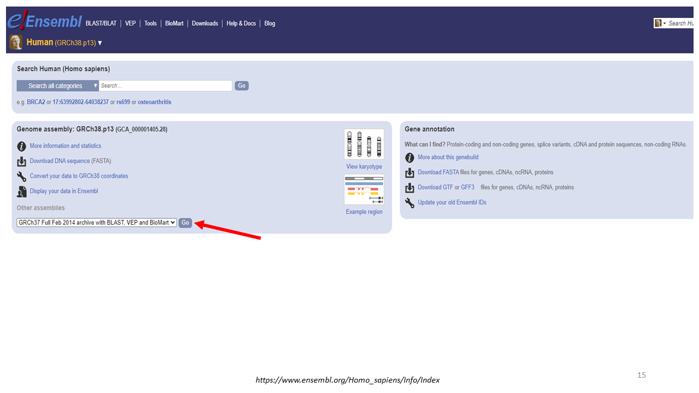
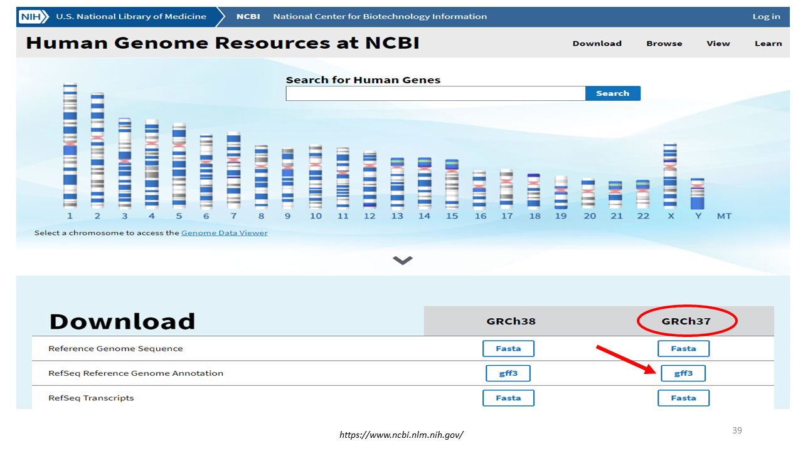

# Downloading annotation files related to hg19 genome assembly from public databases
Created by: Yazdan Asgari 
First creation date: 7 May 2021 
Last Updated: 7 Oct 2021  
**NOTE:** You could find all downloaded annotation files (explained in this section) in the **"2_Gene_annotation"** folder on the server.

- [Downloading annotation files related to hg19 genome assembly from public databases](#downloading-annotation-files-related-to-hg19-genome-assembly-from-public-databases)
  * [Overall Procedure](#overall-procedure)
    + [GENCODE Database](#gencode-database)
    + [ENSEMBL Database](#ensembl-database)
    + [BioMart Tool](#biomart-tool)
    + [UCSC Database](#ucsc-database)
    + [Gene Annotation used in one of our papers](#gene-annotation-used-in-one-of-our-papers)
    + [FANTOM Database](#fantom-database)
    + [Gene Annotation in the Server](#gene-annotation-in-the-server)
    + [NCBI Database](#ncbi-database)
    + [Summary of 10 downloaded gene annotation files](#summary-of-10-downloaded-gene-annotation-files)

## Overall Procedure
As you can see in the following image, we wanted to download 10 different annotation data for hg19 genome assembly from public databases.
  
<kbd>  </kbd>
### GENCODE Database
Based on the GENCODE webpage, *"The goal of the GENCODE project is to identify and classify all gene features in the human and mouse genomes with high accuracy based on biological evidence, and to release these annotations for the benefit of biomedical research and genome interpretation."* 
If you click on the **"Human"** Tab in the website, it is possible to use **"Current release"** for the Human.
  
<kbd>  </kbd>
  
Here, there is files for the lates release. However, they are for **hg38** assembly version. So, you could click on **"Go to GRCh37 version of this release"**.
  
<kbd>  </kbd>
  
In this page, you will see the **GRCh37** data. But if you note, it is mentioned that *"gene annotation originally created on the GRCh38 reference chromosomes, mapped to the GRCh37 primary assembly with gencode-backmap"*. So, it is not what we are looking for.
  
<kbd>  </kbd>
  
Instead, from the **"Human"** tab menu, you should click on **"Release history"**:
  
<kbd>  </kbd>
  
Then, you could select the **GRCh37** assembly (which is GENCODE release 19):
  
<kbd>  </kbd>
  
So, in this page, you could download gene annotation file in a *GTF* file format. 
As you can see, there are two files: the *main annotation* file AND the *superset of the main annotation* file. We downloaded both files for further analyses.
  
<kbd>  </kbd>
  
Now, we have two annotation files downloaded:
  
<kbd>  </kbd>
  
### ENSEMBL Database
As you know, Ensembl is a data resource for the European Bioinformatics Institute (EMBL-EBI).
  
<kbd>  </kbd>
  
In the Ensemble webpage, you need to click on the **"Human"** option.
  
<kbd>  </kbd>
  
Then, in the **"Gene annotation"** box, you could click on **"Download GTF or GFF3"** to download the annotation files. But we know that this data is for the **GRCh38** assembly.
  
<kbd>  </kbd>
  
So, in the **"Genome assembly"** box, use the **"Other assemblies"** drop-down menu to select the **hg19** assembly:
  
<kbd>  </kbd>
  
Similar to the previous assembly page, we expected to obtain the annotation file by clicking on the **"Gene annotation"** box. But the links in this page does NOT work:
  
<kbd>  </kbd>
  
So, you need to use another approach: 
This time, start from the **CRCh38** assembly address and click on **"../"** part of the page to go to the upper levels (called parent folder) of the ftp pages:
  
<kbd>  </kbd>
  
When you reached the **"/pub"** folder, click on the **"grch37"** text, then **"release-104"**, then **"gtf"**, then **"homo_sapiens"**. Now, you can download the annotation file for **hg19** assembly.
  
<kbd>  </kbd>
  
So, we have downloaded 3 annotation files so far:
  
<kbd>  </kbd>
  
### BioMart Tool
If you notice to the Ensembl webpage, you could see **"BioMart"** at the top of the screen.
  
<kbd>  </kbd>
  
In the Wikipedia, you see that *"BioMart is a community-driven project to provide a single point of access to distributed research data."* 
You could select different datasets through **"CHOOSE DATABASE"** drop-down menu in the BioMart page to download different data.
  
<kbd>  </kbd>
  
But as you know, this data is for the **GRCh38** assembly. For access to the **GRCh37** assembly, click on the following link: 
[BioMaer GRCh37 assembly link](https://grch37.ensembl.org/biomart/martview/4f4cea56e8f6f9bbe161ba1f6c97d923)
  
<kbd>  </kbd>
  
Now, in this page, select **"Ensembl Genes 104"**, then **"Human genes (GRCh37.p13)"**. 
If you click on the **"Count"** button, it tells you the number of genes in the Dataset.
  
<kbd>  </kbd>
  
You could set **"Filters"** and adds **"Attributes"** to the dataset to choose what you want to be downloaded. 
Then, click on the **"Results"** button to see 10 lines of the result. 
For download the data, after choosing the output file formar, click on the **"Go"** button.
  
<kbd>  </kbd>
  
This is the fourth annotation file:
  
<kbd>  </kbd>
  
But if you see next to the **"Go"** button, there is an option called **"Unique results only"**. So, selection of that option, we downloaded the next annotation data:
  
<kbd>  </kbd>
  
  
<kbd>  </kbd>
  
### UCSC Database
In the UCSC database, there is a **"Table Browser"** tool used to download the data:
  
<kbd>  </kbd>
  
In the Table browser, by default, there is not a Gene symbol column for downloaded data. For adding Gene Symbol, you should link the official gene symbol via a linkage between the knownGene table and the *kgXref table* in the human assembly as follows: 
Select the following parameters: 
**group:** Genes and Gene Predictions 
**track:** UCSC Genes 
**table:** knownGene 
Then, using the **"paste list"** button, you should upload list of UCSC IDs into the Table Browser.  
**output format:** selected fields from primary and related tables 
Then press the **“get output”** button. 
On this page, you can select **“geneSymbol”** from **“hg19.kgXref fields”** (and other fields that you like) 
Then, press the **“get output”** button again.
  
<kbd>  </kbd>
  
So, we downloaded 6 annotation files so far:
  
<kbd>  </kbd>
  
### Gene Annotation used in one of our papers
The next file is mentioned in the following paper: 
*Gene network and biological pathways associated with susceptibility to differentiated thyroid carcinoma*
 
*Kulkami et al., Sci Rep., 2021 Apr 26;11(1):8932. doi: 10.1038/s41598-021-88253-0*
 
  
<kbd>  </kbd>
  
And here is the address for the annotation file: 
[Annotation file Link](https://ftp.ebi.ac.uk/pub/databases/gencode/Gencode_human/release_28/GRCh37_mapping/)
  
<kbd>  </kbd>
  
You need to download **"gencode.v28lift37.annotation.gtf.gz"** file. 
**NOTE:** if you see the *"README_GRCh37_mapping.txt"*, you find that this file contain GENCODE annotation originally built on GRCh38 that has been *mapped back* to the GRCh37 assembly.
So, we have the 7th annotation file:
  
<kbd>  </kbd>
  
### FANTOM Database
For FANTOM annotation file, you need to go to the FANTOM project webpage:
  
<kbd>  </kbd>
  
Then go to the **"Data"**: 
  
<kbd>  </kbd>
  
In this page, click on the **"Hon_et_al_2016"** data, then **"assembly"**, then **"lv3_robust"**:
  
<kbd>  </kbd>
  
  
<kbd>  </kbd>
  
Then, you need to download **"FANTOM_CAT.lv3_robust.info_table.gene.tsv.gz"** file.
  
<kbd>  </kbd>
  
So, we have the 8th annotation file:
  
<kbd>  </kbd>
  
### Gene Annotation in the Server
Also, there is a file in our server called **"GRCh37_latest_genomic.gff"**:
  
<kbd>  </kbd>
  
So, we have the 9th annotation file:
  
<kbd>  </kbd>
  
### NCBI Database
You could find the annotation file from the NCBI database based on the following path: 
From the NCBI Main page **/ Genome / Human Genome / GRCh37 / gff3**
  
<kbd>  </kbd>
  
  
<kbd>  </kbd>
  
  
<kbd>  </kbd>
  
Downloading the gff3 file, we have the 10th annotation file:
  
<kbd>  </kbd>
  
### Summary of 10 downloaded gene annotation files
So, we have 10 different annotation files, all for **GRCh37 (hg19)** assembly of the Human Genome from the most important public databases. 
For more convenience, we add the name of the database as the starting string for each downloaded file:
  
<kbd>  </kbd>
  
Now you can go to the [Analysis Section](../1_Analyzing) to see the similarity and differences of these annotation files.
