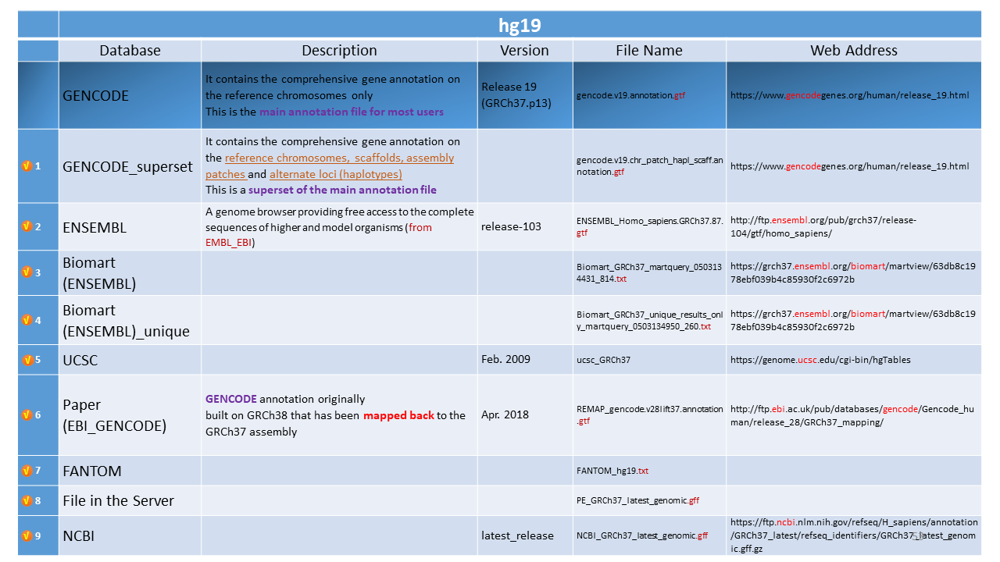

# Analysis of the downloaded annotation files for for hg19 genome assembly
Created by: Yazdan Asgari 
Creation date: 7 May 2021 
Update: 7 Oct 2021  

**NOTE:** You could find all downloaded annotation files (explained in this section) in the **"2_Gene_annotation"** folder on the server.

## Table of Contents
- [Analysis of the downloaded annotation files for for hg19 genome assembly](#analysis-of-the-downloaded-annotation-files-for-for-hg19-genome-assembly)
  * [Comparing the Files](#comparing-the-files)
    + [PE and NCBI](#pe-and-ncbi)
    + [GENCODE and GENCODE superset](#gencode-and-gencode-superset)
    + [Biomart and Biomart unique](#biomart-and-biomart-unique)
    + [GENCODE superset and ENSEMBL and Biomart and the paper files](#gencode-superset-and-ensembl-and-biomart-and-the-paper-files)
    + [GENCODE superset and Biomart and the paper file and file in the Server and NCBI files](#gencode-superset-and-biomart-and-the-paper-file-and-file-in-the-server-and-ncbi-files)
    + [GENCODE superset and Biomart and the paper file and file in the Server and NCBI file and FANTOM files](#gencode-superset-and-biomart-and-the-paper-file-and-file-in-the-server-and-ncbi-file-and-fantom-files)
  * [Building a final file](#building-a-final-file)
  * [Summary of Analyses](#summary-of-analyses)
- [Selection of the Annotation file](#selection-of-the-annotation-file)
  * [Analyses on the inflammation pathway-related genes](#analyses-on-the-inflammation-pathway-related-genes)
  * [Analyses on the selected annotation file](#analyses-on-the-selected-annotation-file)
  * [Non-coding annotation file](#non-coding-annotation-file)

## Comparing the Files
### PE and NCBI
First, we compared the file in the server with NCBI file:
  
<kbd>  </kbd>
  
Based on the header of these two files, it seems they should be very similar to each other.
  
<kbd>  </kbd>
  
As you can see in the picture, PE and NCBI protein_coding genes are ~ 92% similarity (using unique gene_name).  
For re-running the results, perform **#1** in the [R code](code_annotation_hg19.R).
  
<kbd>  </kbd>
  
### GENCODE and GENCODE superset
Then, we compared two files related to the GENCODE database:
  
<kbd>  </kbd>
  
As you can see in the picture, **GENCODE_superset** contains all of the **GENCODE** file.  
For re-running the results, perform **#2** in the [R code](code_annotation_hg19.R).
  
<kbd>  </kbd>
  
So, it is possible to just consider the **GENCODE_superset** file for further analysis.
  
<kbd>  </kbd>
  
### Biomart and Biomart unique
Then, we compared two files related to the Biomart tool:
  
<kbd>  </kbd>
  
As you can see in the picture, two files are exactly similar.  
For re-running the results, perform **#3** in the [R code](code_annotation_hg19.R).
  
<kbd>  </kbd>
  
So, it is possible to just consider the **Biomart** file for further analysis.
  
<kbd>  </kbd>
  
### GENCODE superset and ENSEMBL and Biomart and the paper files
Then, we compared four files (GENCODE_superset, ENSEMBL, Biomart, and file used in the paper):
  
<kbd>  </kbd>
  
As you can see in the picture, **Biomart** contains all coding genes of **ENSEMBL** file. 
For re-running the results, perform **#4** in the [R code](code_annotation_hg19.R).
  
<kbd>  </kbd>
  
So, it is possible to just ignore the **ENSEMBL** file for further analysis.
  
<kbd>  </kbd>
  
### GENCODE superset and Biomart and the paper file and file in the Server and NCBI files
Then, we compared five files in two different four groups: 
GENCODE_superset, Biomart, file used in the paper, file available in the Server. 
GENCODE_superset, Biomart, file used in the paper, NCBI files.
  
<kbd>  </kbd>
  
Here are the results: 
For re-running the results, perform **#5 & #6** in the [R code](code_annotation_hg19.R).
**NOTE:** UCSC does not have gene class (gene type) information. So, we should remove it (for protein_coding class).
  
<kbd>  </kbd>
  
### GENCODE superset and Biomart and the paper file and file in the Server and NCBI file and FANTOM files
Then, we compared six files in three different four groups:
GENCODE_superset, Biomart, file used in the paper, file available in the Server. 
GENCODE_superset, Biomart, file used in the paper, NCBI files. 
GENCODE_superset, Biomart, file used in the paper, FANTOM.
  
<kbd>  </kbd>
  
Here are the results: 
For re-running the results, perform **#5 & #6 & #7** in the [R code](code_annotation_hg19.R).
  
<kbd>  </kbd>
  
## Building a final file 
So, here we talk about *how to build an annotation file for protein_coding genes"* based on our analyses.
  
<kbd>  </kbd>
  
It should be mentioned that, biologically speaking, the annotation file must be similar to the reference genome that a GWAS data has been derived from.
  
<kbd>  </kbd>
  
However, in our situation, we could devide our data into four category:
  
<kbd>  </kbd>
  
Here are some suggestions for creation of an annotation file:
Consider union of 5 files (GENCODE_superset, Biomart-ENSEMBL, Paper-EBI_GENCODE, PE, NCBI)
  
<kbd>  </kbd>
  
Here is the output of the assumption: 
For re-running the results, perform **#8** in the [R code](code_annotation_hg19.R).
  
<kbd>  </kbd>
  
Here are another suggestions for creation of an annotation file: 
Consider union of similar databases files  
GENCODE_superset, Biomart-ENSEMBL, Paper-EBI_GENCODE together 
OR 
PE, NCBI together
  
<kbd>  </kbd>
  
Here is the output of the *"GENCODE_superset, Biomart-ENSEMBL, Paper-EBI_GENCODE together"*: 
For re-running the results, perform **#9 & #10** in the [R code](code_annotation_hg19.R).
  
<kbd>  </kbd>
  
Here is the output of the *"PE, NCBI together"*: 
For re-running the results, perform **#11** in the [R code](code_annotation_hg19.R).
  
<kbd>  </kbd>
  
Here is another suggestion for creation of an annotation file: 
Consider union of all databases files  
GENCODE_superset, Biomart-ENSEMBL, Paper-EBI_GENCODE, PE, NCBI, FANTOM 
**NOTE:** UCSC does NOT have Gene_class.
  
<kbd>  </kbd>
  
Here is the output: 
For re-running the results, perform **#12** in the [R code](code_annotation_hg19.R).
  
<kbd>  </kbd>
  
But there is still a question to be answered: 
Should we prioritize databases or keep all tag information?
  
<kbd>  </kbd>
  

## Summary of Analyses
We have analyzed 10 different downloaded annotation files for Protein_coding category.
  
<kbd>  </kbd>
  
Here is the summary of the work, questions, qnd challenges that remains to be recovered for building a final annotation file.
  
<kbd>  </kbd>
  

# Selection of the Annotation file
**Selection:** After careful dealing with the results, and considering the fact that we should regularly update the annotation file on the case of any new releases, we decided to chose the file from the GENCODE database. So, we selected the file contains the the comprehensive gene annotation **originally created on the GRCh38 reference chromosomes, mapped to the GRCh37 primary assembly with gencode-backmap** (which is similar to the file used in the paper "*gencode.v28lift37.annotation.gft*").  
We downloaded the latest version of the file called "*latest_gencode.v38lift37.annotation.gtf*". (We rename the file into "**REMAP_latest_gencode.v38lift37.annotation.gtf**" in order to remember it is remapped from hg38 into hg19 assembly.   
Here, we perfomed some analyses on the "**REMAP_latest_gencode.v38lift37.annotation.gtf**" file:
 

## Analyses on the inflammation pathway-related genes
In this section, we tested whether the Inflammatory pathways-related genes exists in the annotation files or not.
 
The gene list is based on the [**Supplementary file S1**](2007_loza_S1.xls) of the following paper:
*Assembly of Inflammation-Related Genes for Pathway-Focused Genetic Analysis*
 
*Loza et al., PLoS One. 2007; 2(10): e1035. doi: 10.1371/journal.pone.0001035*
 
 
If you see the Excel file, there are **1027** Inflammation-Related Genes.
 
 
**First**, we just looked for the Inflammation-Related Genes in the **Protein_coding** gene class of the annotation files:  
1- Finding the total number of Inflammation-Related Genes in the GENCODE annotation file 
For the R program, see the *# 1- coding_gencode* section in the [code_inflame](code_inflame.R)  

**NOTE:** If you see the fourth column from the left (**Not_found**) for the first row, you see that 70 genes out of 1027 Inflammation-Related Genes did not find within the protein_coding genes of the GENCODE database. Is it true? To check that, we put all 1027 Inflammation-Related Genes into the HGNC web page to find the **Approved Gene Symbol** for each genes.
 
To do that, first, go to the following web page: 
[https://www.genenames.org/tools/multi-symbol-checker/](https://www.genenames.org/tools/multi-symbol-checker/) 
Then, paste the input genes into the box, then, click *"submut"*. When the results appeare, click on *"CSV download"*. 
Then, we removed the duplicates gene names by comparing them with the **Supplementary file S1** of the paper (by looking at the chromosome locations). 
Therefore, we made a new Inflammation-Related Genes list which we called it **"Pathways_genes_hgnc_input.csv"**. 
So, there are two parts for each rows in the following Results Table: One with comparing to the Inflammation-Related Genes symbols available in the published paper and Another one with comparing to the **"Pathways_genes_hgnc_input.csv"** file (which we built from the HGNC web page and manually corrected them). 
**NOTE:** To understand what we mean by "manually corrected" the results, you could see this two files as examples ([Example_1](0_Images/example1.PNG) AND [Example_2](0_Images/example2.PNG))
 
 
2- Finding the total number of Inflammation-Related Genes in the GENCODE superset annotation file 
For the R program, see the *# 2- coding_gencode_superset* section in the [code_inflame](code_inflame.R)  
3- Finding the total number of Inflammation-Related Genes in the REMAP annotation file used in our paper 
For the R program, see the *# 3- coding_REMAP_gencode_ebi_ftp* section in the [code_inflame](code_inflame.R)  
4- Finding the total number of Inflammation-Related Genes in the latest version of REMAP annotation file 
For the R program, see the *# 4- coding_REMAP_latest* section in the [code_inflame](code_inflame.R) 

**Then**, we looked for the Inflammation-Related Genes in the **All** gene class of the annotation files:  
5- Finding the total number of Inflammation-Related Genes in the GENCODE annotation file 
For the R program, see the *# 5- gencode_all* section in the [code_inflame](code_inflame.R)  
6- Finding the total number of Inflammation-Related Genes in the GENCODE superset annotation file 
For the R program, see the *# 6- gencode_superset_all* section in the [code_inflame](code_inflame.R)  
7- Finding the total number of Inflammation-Related Genes in the REMAP annotation file used in our paper 
For the R program, see the *# 7- REMAP_gencode_ebi_ftp_all* section in the [code_inflame](code_inflame.R)  
8- Finding the total number of Inflammation-Related Genes in the latest version of REMAP annotation file 
For the R program, see the *# 8- REMAP_latest_all* section in the [code_inflame](code_inflame.R)  
 
Here are the results of all 8 parts (mentioned above) in a summary:
  
<kbd>  </kbd>
  
So, you can see that if we compare the Inflammation-Related Genes **(their Approved HGNC gene symbol)** to the **"GENCODE REMAP latest version"**, here would be the results: 
Out of **1027** Inflammation-Related Genes: 
**1019** protein_coding genes 
**6** non-coding genes
| Gene Symbol | Gene Class |
| --- | --- | 
| CASP12	| polymorphic_pseudogene |
| FCGR1CP | unprocessed_pseudogene | 
| IGHA1 | IG_C_gene | 
| KIR2DS4 | polymorphic_pseudogene | 
| LILRP2 | transcribed_processed_pseudogene | 
| TRGV9 | TR_V_gene |

**2** Not_found
| Gene Symbol | Location | Primary_Pathway |
| --- | --- | --- | 
| LILRA3 | 19q13.4 | Leukocyte signaling | 
| PECAM1 | 17q23.3 | Adhesion-Extravasation-Migration |

We have added the HGNC-derived data on the *Supplementary file S1* as new columns. You can find the new file [Supplementary file S1_hgnc](2007_loza_S1_new_bp_pos_added.xlsx)
 

## Analyses on the selected annotation file
You could find the code in R programming language [here](code_gene_validation_summary.R)  
Total number of **genes** = **62,446** 
Total number of unique genes (JUST by looking at gene name) = 60,469 
Total number of unique genes (by looking at **gene name** & **chromosome**) = **60,930** 
 
Total number of **protein_coding** genes = **20,082** 
Total number of unique protein_coding genes (JUST by looking at gene name) = 20,056  
Total number of unique protein_coding genes (by looking at **gene name & chromosome**) = **20,075** 

When reading the file in R, there are several culumns which you could find their meanings by looking at the following link provided by the GENCODE database:
 
[https://www.gencodegenes.org/pages/data_format.html](https://www.gencodegenes.org/pages/data_format.html)
 
Besides, you could find more information by looking at the following page: 
[https://www.gencodegenes.org/pages/faq.html](https://www.gencodegenes.org/pages/faq.html)
 
 
Here, we mention some important definitions:
  
**What do "HAVANA" and "ENSEMBL" mean in the GTF/GFF3?**
 
The second field in the GTF/GFF3 files shows the annotation source for each feature. The HAVANA team have relocated from the Wellcome Trust Sanger Institute to the EMBL-EBI to join the Ensembl team and as such the terms "HAVANA" and "ENSEMBL" are anachronistic in this context. However, in the files "HAVANA" indicates that the feature was manually annotated, although it may also be the product of the merge between Havana manual annotation and Ensembl-genebuild automated annotation. "ENSEMBL" refers exclusively to annotation provided by the automated Ensembl-genebuild pipeline.
 
 
**What does level 1, 2 or 3 mean in the GTF/GFF3?**
 
They supply genome-wide features on three different confidence levels:
 
*Level 1 - validated*
 
Pseudogene loci that were jointly predicted by the Yale Pseudopipe and UCSC Retrofinder pipelines as well as by Havana manual annotation; other transcripts that were verified experimentally by RT-PCR and sequencing through the GENCODE experimental pipeline.
 
*Level 2 - manual annotation*
 
Havana manual annotation (and Ensembl annotation where it is identical to Havana).
 
*Level 3 - automated annotation*
 
Ensembl loci where they are different from the Havana annotation or where no Havana annotation can be found.
 
Please note that not all transcripts have been tested by the GENCODE experimental pipeline and that level 2/3 transcripts may have been experimentally validated elsewhere.
 
 
***What is the gene/transcript status in the GTF/GFF3?***
 
The gene_status and transcript_status fields were removed after releases 25 and M11 because they no longer served their original purpose. The KNOWN status indicates that the gene has cross references to curated cDNA and/or protein resources, so it could be used to distinguish well supported annotation. However, the vast majority of GENCODE genes are now supported by RefSeq cDNAs or UniProt proteins. In fact, releases 25 and M11 had over 96% and 99% of KNOWN genes, respectively. There are other fields in the GTF file that can be used to find well-supported annotation at the transcript level, such as the transcript_support_level.
 
Prior to release 25/M11 the status indicated the type of evidence supporting the annotation.
 
*KNOWN:* 
Identical to known cDNAs or proteins from the same species and has an entry in species specific model databases: EntrezGene for human.
 
*NOVEL:* 
Identical or homologous to cDNAs from the same species, or proteins from all species.
 
*PUTATIVE:* 
Identical or homologous to spliced ESTs from the same species.
 
*KNOWN_BY_PROJECTION:* 
Based on a known orthologue gene in another species.
 
 
**NOTE:** We have also checked two different files (*"Comprehensive gene annotation"* and *"Basic gene annotation"*) available for the latest version of the GENCODE annotation  (*"gencode.v38lift37.annotation"* and *"gencode.v38lift37.basic.annotation"*). Both files have the same number of genes. So, we picked the Comprehensive file for the annotation (*"gencode.v38lift37.annotation"*).

## Non-coding annotation file
*Currently, our group just works with an annotation data including coding-genes or all genes. So, creation of an annotation file including just non-coding genes will be covered if it is needed in the future.*

In the [Creation of the annotation file Section](../2_Creation_annot_file), we deal with pre_processing of the selected file to created different annotation files based on the original file.
