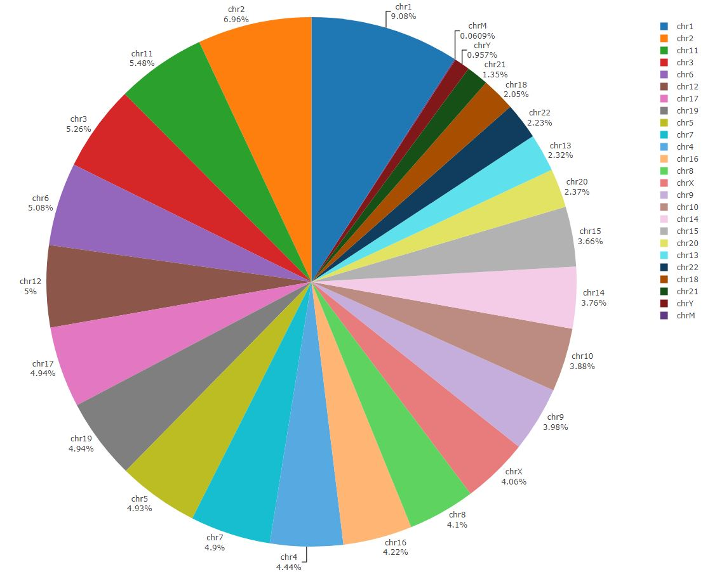

# Creation of the annotation files for hg19 genome assembly
Created by: Yazdan Asgari<br>
Creation date: 7 May 2021<br>
Update: Feb 2024<br><br>

## Table of Contents
- [Creation of the annotation files for hg19 genome assembly](#creation-of-the-annotation-files-for-hg19-genome-assembly)
  * [Annotation file for Protein-coding genes](#annotation-file-for-protein-coding-genes)
    + [Summary of the annotation file for Protein-coding genes](#summary-of-the-annotation-file-for-protein-coding-genes)
  * [Annotation file for All gene classes](#annotation-file-for-all-gene-classes)
    + [Summary of the annotation file for All gene classes](#summary-of-the-annotation-file-for-all-gene-classes)

## Annotation file for Protein-coding genes
Here, we are going to create an annotation file for **"Protein_coding"** genes based on the latest Human Genome Assembly from the GENCODE database. Note that we selected the file containing the comprehensive gene annotation **originally created on the GRCh38 reference chromosomes, mapped to the GRCh37 primary assembly with gencode-backmap**.
<br>
<br>
The latest version of the file is called "*latest_gencode.v38lift37.annotation.gtf*". (We rename the file into "**REMAP_latest_gencode.v38lift37.annotation.gtf**" in order to remember it is remapped from hg38 into hg19 assembly. It is also a newer version of the annotation file used in our previous paper: <br>
*Gene network and biological pathways associated with susceptibility to differentiated thyroid carcinoma*
<br>
*Kulkami et al., Sci Rep., 2021 Apr 26;11(1):8932. doi: 10.1038/s41598-021-88253-0*
<br>
<br>
Besides, to find out how it was downloaded, you can see the [**"Download"**](../0_Download) section and also in the **"Selection of the Annotation file"** part of the [**"Analyzing"**](../1_Analyzing) section.
<br>
<br>
- Here are the **R code** with all information that anyone needs to create a **"Protein_coding"** genes annotation file:
- The first step is importing the downloaded annotation file. If you do not know how to read the *.gtf* annotation file, please see the **R code** related to the [**"Analysis"**](../1_Analyzing) section.
```r
# You need to determine the Path where the "REMAP_latest_gencode.v38lift37" file exists
# =============================================================================
setwd("THE_PATH_FOR_ANNOTATION_FILE")
# =============================================================================
# loading the "REMAP_latest_gencode.v38lift37" data
# =============================================================================
load("remap_latest.RData")
```
- Since the downloaded file does not contain **"ENTREZ_IDs"** for every gene, we need to download a file from the [**HGNC web page**](https://www.genenames.org/download/custom/) which contains the information of *gene_names, HGNC_IDs, ENTREZ_ID,* and more for Human. 
```r
# ======================================================================================================
# Add "ENTREZ_ID" column to the data based on the HGNC ID (information from the file "hgnc_entrez.txt")
# ======================================================================================================
hgnc_entrez <- read.delim('hgnc_entrez.txt',header = TRUE,sep = "\t", quote = "\"",
                          dec = ".", fill = TRUE)
REMAP_latest$ENTREZ_ID <- hgnc_entrez$NCBI.Gene.ID[match(REMAP_latest$hgnc_id, hgnc_entrez$HGNC.ID)]
```
- extract **"protein-coding"** genes with the **"gene"** label (because the gene label contains the **MIN** and **MAX** (for start and stop base-pair positions, respectively) considering all variants of the genes):
```r
genes_coding_REMAP_latest <- REMAP_latest[which(REMAP_latest$type=="gene"  & 
                                                  REMAP_latest$gene_type=="protein_coding" 
                                                ),
                                          ]
```
- Checking if there is any duplication in gene_names
```r
length(genes_coding_REMAP_latest$gene_name)
length(unique(genes_coding_REMAP_latest$gene_name))
```
- finding duplicated gene_names
```r
dup_coding_genes <- genes_coding_REMAP_latest[duplicated(genes_coding_REMAP_latest[c("gene_name", "seqnames")]) | duplicated(genes_coding_REMAP_latest[c("gene_name", "seqnames")], fromLast=TRUE),]
View(dup_coding_genes)
length(dup_coding_genes$gene_name)
```
- Here is the list of duplicated genes (which have both similar gene_names & chromosome numbers) found in the annotation file (with **"protein-coding"** tag as **gene_type**):

| No | gene_name |	chr	| start	| end	| length	| strand	| gene_type	| hgnc_id	| ENTREZ_ID | 
| -- | -- | -- | -- | -- | -- | -- | -- | -- | -- |
| 1 | TBCE	| chr1	| 235491885	| 235612267	| 120383	| +	| protein_coding	| HGNC:11582	| 6905 |
| 2 | TBCE	| chr1	| 235530675	| 235615756	| 85082	| +	| protein_coding	| HGNC:11582	| 6905 |
| 3 | PDE11A	| chr2	| 178487972	| 178937504	| 449533	| -	| protein_coding	| HGNC:8773	| 50940 |
| 4 | PDE11A	| chr2	| 178492797	| 178973066	| 480270	| -	| protein_coding	| NA	| NA |
| 5 | MATR3	| chr5	| 138609441	| 138667360	| 57920	| +	| protein_coding	| NA	| NA |
| 6 | MATR3	| chr5	| 138629363	| 138667366	| 38004	| +	| protein_coding	| HGNC:6912	| 9782 |
| 7 | POLR2J3	| chr7	| 102178365	| 102213100	| 34736	| -	| protein_coding	| HGNC:33853	| 548644 |
| 8 | POLR2J3	| chr7	| 102202580	| 102213030	| 10451	| -	| protein_coding	| HGNC:33853	| 548644 |
| 9 | PINX1	| chr8	| 10582909	| 10697357	| 114449	| -	| protein_coding	| HGNC:30046	| 54984 |
| 10 | PINX1	| chr8	| 10622471	| 10697394	| 74924	| -	| protein_coding	| HGNC:30046	| 54984 |
| 11 | SIGLEC5	| chr19	| 52114213	| 52150142	| 35930	| -	| protein_coding	| HGNC:10874	| 8778 |
| 12 | SIGLEC5	| chr19	| 52115180	| 52148798	| 33619	| -	| protein_coding	| HGNC:10874	| 8778 |
| 13 | MAGEA9B	| chrX	| 148663309	| 148669116	| 5808	| -	| protein_coding	| NA	| NA |
| 14 | MAGEA9B	| chrX	| 148663309	| 148669116	| 5808	| -	| protein_coding	| HGNC:31909	| 728269 |

- finding indices for rows containing duplicated gene_names
```r
dup_coding_genes_index <- which(duplicated(genes_coding_REMAP_latest[c("gene_name", "seqnames")]) | duplicated(genes_coding_REMAP_latest[c("gene_name", "seqnames")], fromLast=TRUE))
```
- remove the rows containing duplicated gene_names
```r
genes_coding_del_dup_REMAP_latest <- genes_coding_REMAP_latest[-dup_coding_genes_index,]
```
- **NOTE:** These following two numbers differ because we just tested based on the gene_name. Although there are some similar gene_names, they are located in different **X** and **Y** chromosomes. So, we just keep such cases in the annotation file.
```r
length(genes_coding_del_dup_REMAP_latest$gene_name)
length(unique(genes_coding_del_dup_REMAP_latest$gene_name))
```
- Merging duplicated genes(picking **MIN** for **start bp** and **MAX** for **end bp**) and also picking the one with **HGNC** and **ENTREZ ID** (if any of them has **NOT** such information)
```r
dl <- split(dup_coding_genes, dup_coding_genes$gene_name)
d2 <- as.data.frame(t(sapply(dl, function(x) {c(as.character(unique(x$seqnames)), 
                                                min(x$start), 
                                                max(x$end), 
                                                as.character(unique(x$gene_name)), 
                                                as.character(unique(na.omit(x$hgnc_id))),
                                                as.character(unique(na.omit(x$ENTREZ_ID)))
                                                )}
                             )
                      )
                    )

# Convert V2(start bp) and V3(end bp) and V5(ENTREZ_ID) from characters to numbers
d2$V2 <- as.numeric(as.character(d2$V2)) 
d2$V3 <- as.numeric(as.character(d2$V3))
d2$V6 <- as.numeric(as.character(d2$V6))
# Add column names (similar to the initial annotation file) instead of V1-6
colnames(d2)=c("seqnames","start","end","gene_name","hgnc_id","ENTREZ_ID")
```
- extract **"protein-coding" genes** with the **"gene"** label because if you look at every row with a **"gene"** label, it already contains the **MIN** and **MAX** (for start and stop base-pair positions, respectively) considering all variants of the gene (**NOTE:** we have created it before in this file with the *"genes_coding_del_dup_REMAP_latest"* name)
- for every duplicated case, we consider **MIN** for **start bp** and **MAX** for **end bp**
```r
annot_coding <- genes_coding_del_dup_REMAP_latest[,c("seqnames","start","end","gene_name","hgnc_id","ENTREZ_ID")]
length(annot_coding$hgnc_id)
annot_coding_final <- rbind(annot_coding,d2)
length(annot_coding_final$hgnc_id)
```
- checking the final results
- **NOTE:** these following numbers differ because genes with the same gene_names in **X** and **Y** chromosomes have the same **"HGNC"** and **"ENTREZ"** IDs. 
- There are also some *NA* values for **"HGNC"** and **"ENTREZ"** IDs which consider as duplication by the command. So, it is not anything which biologically meaningless for the final annotation file.
```r
summary(annot_coding_final)
length(annot_coding_final$hgnc_id)
length(unique(annot_coding_final$hgnc_id))
length(annot_coding_final$ENTREZ_ID)
length(unique(annot_coding_final$ENTREZ_ID))
A <- annot_coding_final[duplicated(annot_coding_final["ENTREZ_ID"]) | duplicated(annot_coding_final["ENTREZ_ID"], fromLast=TRUE),]
A <- A[order(A$ENTREZ_ID),]
A
B <- annot_coding_final[duplicated(annot_coding_final["hgnc_id"]) | duplicated(annot_coding_final["hgnc_id"], fromLast=TRUE),]
B <- B[order(B$hgnc_id),]
B
```
- Saving the final annotation result
```r
write.table(annot_coding_final, file = "annot_coding_final_gencode.v38lift37.txt", sep = "\t",
            row.names = FALSE, col.names = TRUE)
```
- Here are some first rows for the Protein_coding annotation file (hg19 assembly)

| seqnames | start | end | gene_name | hgnc_id | ENTREZ_ID |
| -- | -- | -- | -- | -- | -- | 
| chr1 | 65419| 71585| OR4F5 | HGNC:14825 | 79501 |
| chr1 | 134901 | 139379 | AL627309.1 | NA | NA | 
| chr1 | 367640 | 368634 | OR4F29 | NA | NA |
| chr1 | 621059 | 622053 | OR4F16 | HGNC:15079 | 81399 |
| chr1 | 859303 | 879955 | SAMD11 | HGNC:28706 | 148398 |
| chr1 | 879583 | 894689 | NOC2L | HGNC:24517 | 26155 |
| chr1 | 895964 | 901099 | KLHL17 | HGNC:24023 | 339451 |
| chr1 | 901862 | 911245 | PLEKHN1 | HGNC:25284 | 84069 |
| chr1 | 910584 | 917473 | PERM1 | HGNC:28208 | 84808 |

### Summary of the annotation file for Protein-coding genes
- You could find the file in the **"2_Gene_annotation"** folder on the server
- Total number of **protein_coding** genes = **20,075**
- Total number of **protein_coding** genes in **each chromosome**
```r
summary(annot_coding_final$seqnames)
 chr1  chr2  chr3  chr4  chr5  chr6  chr7  chr8  chr9 chr10 chr11 chr12 chr13 chr14 chr15 chr16 chr17 chr18 chr19 chr20 
 2080  1250  1075   756   883  1044   920   689   798   738  1311  1036   320   610   603   857  1185   269  1472   545 
chr21 chr22  chrX  chrY  chrM 
  244   447   864    66    13
```
- Sorting the result
```r
sort(summary(annot_coding_final$seqnames),decreasing = TRUE)
 chr1 chr19 chr11  chr2 chr17  chr3  chr6 chr12  chr7  chr5  chrX chr16  chr9  chr4 chr10  chr8 chr14 chr15 chr20 chr22 
 2080  1472  1311  1250  1185  1075  1044  1036   920   883   864   857   798   756   738   689   610   603   545   447 
chr13 chr18 chr21  chrY  chrM 
  320   269   244    66    13 
```
- creation of a pie chart for the number of protein-coding genes in each chromosome
```r
library(ggplot2)
library(plotly)
A <- summary(annot_coding_final$seqnames)
B <- paste0('chr', 1:22)
B <- c(B,'chrX','chrY','chrM')
gene_df <- data.frame(A,B)
plot_ly(gene_df, labels = ~B, values = ~A, type = 'pie',textposition = 'outside',textinfo = 'label+percent') %>%
  layout(xaxis = list(showgrid = FALSE, zeroline = FALSE, showticklabels = FALSE),
         yaxis = list(showgrid = FALSE, zeroline = FALSE, showticklabels = FALSE))
```
<br></br>
<kbd>  </kbd>
<br></br>

## Annotation file for All gene classes
Here, we are going to create an annotation file for **"All"** genes based on the latest Human Genome Assembly from the GENCODE database. Note that we selected the file containing the comprehensive gene annotation **originally created on the GRCh38 reference chromosomes, mapped to the GRCh37 primary assembly with gencode-backmap**.
<br>
<br>
The latest version of the file is called "*latest_gencode.v38lift37.annotation.gtf*". (We rename the file into "**REMAP_latest_gencode.v38lift37.annotation.gtf**" in order to remember it is remapped from hg38 into hg19 assembly. It is also a newer version of the annotation file used in our previous paper: <br>
*Gene network and biological pathways associated with susceptibility to differentiated thyroid carcinoma*
<br>
*Kulkami et al., Sci Rep., 2021 Apr 26;11(1):8932. doi: 10.1038/s41598-021-88253-0*
<br>
<br>
Besides, to find out how it was downloaded, you can see the [**"Download"**](../0_Download) section and also in the **"Selection of the Annotation file"** part of the [**"Analyzing"**](../1_Analyzing) section.
<br>
<br>
- Here are the **R code** with all information that anyone needs to create a **"All"** genes annotation file:
- The first step is importing the downloaded annotation file. If you do not know how to read the *.gtf* annotation file, , please see the **R code** related to the [**"Analysis"**](../1_Analyzing) section.
```r
# You need to determine the Path where the "REMAP_latest_gencode.v38lift37" file exists
# =============================================================================
setwd("THE_PATH_FOR_ANNOTATION_FILE")
# =============================================================================
# loading the "REMAP_latest_gencode.v38lift37" data
# =============================================================================
load("remap_latest.RData")
```
- Since the downloaded file does not contain **"ENTREZ_IDs"** for every gene, we need to download a file from the [**HGNC web page**](https://www.genenames.org/download/custom/) which contains the information of *gene_names, HGNC_IDs, ENTREZ_ID,* and more for Human.
```r
# ======================================================================================================
# Add "ENTREZ_ID" column to the data based on the HGNC ID (information from the file "hgnc_entrez.txt")
# ======================================================================================================
hgnc_entrez <- read.delim('hgnc_entrez.txt',header = TRUE,sep = "\t", quote = "\"",
                          dec = ".", fill = TRUE)

REMAP_latest$ENTREZ_ID <- hgnc_entrez$NCBI.Gene.ID[match(REMAP_latest$hgnc_id, hgnc_entrez$HGNC.ID)]
```
- extract entries with the **"gene"** label because the gene label contains the **MIN** and **MAX** (for start and stop base-pair positions, respectively) considering all variants of the genes
```r
genes_all_REMAP_latest <- REMAP_latest[which(REMAP_latest$type=="gene"),]
```
- Checking if there is any duplication in gene_names
```r
length(genes_all_REMAP_latest$gene_name)
length(unique(genes_all_REMAP_latest$gene_name))
```
- finding duplicated gene_names
```r
dup_all_genes <- genes_all_REMAP_latest[duplicated(genes_all_REMAP_latest[c("gene_name", "seqnames")]) | duplicated(genes_all_REMAP_latest[c("gene_name", "seqnames")], fromLast=TRUE),]
View(dup_all_genes)
length(dup_all_genes$gene_name)
```
- Saving duplicated genes in a text file
```r
write.table(dup_all_genes, file = "dup_all_genes.txt", sep = "\t",
            row.names = FALSE, col.names = TRUE)
```           
- Finding **suspicous genes** which have **similar gene names** but they **appeare in different chromosomes**. **NOTE:** It does **NOT** include genes with different names but in X and Y chromosomes (because it is biologically meaningful).
```r
suspicious_genes_finder <- split(dup_all_genes, dup_all_genes$gene_name)
length(suspicious_genes_finder)
i_range <- seq(1:length(suspicious_genes_finder))
suspicious_genes <- sapply(i_range,
                           function(x) 
                           {
                             as.character(ifelse( (length(unique(suspicious_genes_finder[[x]]$seqnames)))>1,unique(suspicious_genes_finder[[x]]$gene_name),NA) )
                           } 
)
suspicious_genes <- na.omit(suspicious_genes)
suspicious_genes_df <- as.data.frame(suspicious_genes)
output_suspicious_genes <- dup_all_genes[which(dup_all_genes$gene_name %in% suspicious_genes_df$suspicious_genes),] 
```
- saving suspicious genes in a text file
```r
write.table(output_suspicious_genes, file = "suspicious_genes.txt", sep = "\t",
            row.names = FALSE, col.names = TRUE)
```
- finding indices for rows containing duplication gene_names
```r
dup_all_genes_index <- which(duplicated(genes_all_REMAP_latest[c("gene_name", "seqnames")]) | duplicated(genes_all_REMAP_latest[c("gene_name", "seqnames")], fromLast=TRUE))
```
- remove the rows containing duplicated gene_names
```r
genes_all_del_dup_REMAP_latest <- genes_all_REMAP_latest[-dup_all_genes_index,]
```
- NOTE: these following two numbers differ because we just tested based on the gene_name. Although there are some similar gene_names, they are located in different X and Y chromosomes. So, we just keep such cases in the annotation file.
```r
length(genes_all_del_dup_REMAP_latest$gene_name)
length(unique(genes_all_del_dup_REMAP_latest$gene_name))
```
- **Question: What is the difference between *duplicated genes* and *suspicious genes* in our analysis?** 
- **Answer:** The **duplicated genes** are genes which have similar **gene name** and also are in the **same chromosome**. They can be easily merged by picking **MIN** for start  and **MAX** for end base-pair positions. But **suspicious genes** are genes that have similar **gene name** but they appeared in **different chromosomes**. This is a slightly strange situation biologically. However, they are available in the downloaded annotation file and we just removed them from the final annotation file.
- Here is the list of **suspicious genes** we found in the annotation file:

| No | suspicious genes | gene class |
| -- | -- | -- |
| 1 | SCARNA16	| snoRNA |
| 2 | SCARNA20	| snoRNA |
| 3 | SNORA18	| snoRNA |
| 4 | SNORA25	| snoRNA |
| 5 | SNORA26	| snoRNA |
| 6 | SNORA31	| snoRNA |
| 7 | SNORA40	| snoRNA |
| 8 | SNORA48	| snoRNA |
| 9 | SNORA51	| snoRNA |
| 10 | SNORA63	| snoRNA |
| 11 | SNORA70	| snoRNA |
| 12 | SNORA72	| snoRNA |
| 13 | SNORA73	| snoRNA |
| 14 | SNORA74	| snoRNA |
| 15 | SNORA75	| snoRNA |
| 16 | SNORD112	| snoRNA |
| 17 | snoU13	| snoRNA |
| 18 | U3	| snoRNA |
| 19 | U6	| snRNA |
| 20 | U8	| snoRNA |
| 21 | Vault	| misc_RNA |
| 22 | Y_RNA	| misc_RNA |

- removing the suspicious genes from the duplicated genes
```r
length(which(is.element(dup_all_genes$gene_name, suspicious_genes)))
dup_all_genes <- dup_all_genes[-which(is.element(dup_all_genes$gene_name, suspicious_genes)),]
class(dup_all_genes)
length(dup_all_genes$gene_name)
```
- Merging duplicated genes(picking MIN for start bp and MAX for end bp) and also picking the one with HGNC and ENTREZ ID (if any of them has NOT such information)
```r
d1 <- split(dup_all_genes, dup_all_genes$gene_name)
d2 <- as.data.frame(t(sapply(d1, function(x) {c(as.character(unique(x$seqnames)), 
                                                min(x$start), 
                                                max(x$end), 
                                                as.character(unique(x$gene_name)), 
                                                as.character(
                                                  ifelse(length(unique(na.omit(x$hgnc_id)))>0,unique(na.omit(x$hgnc_id)),'NA')),
                                                as.character(
                                                  ifelse(length(unique(na.omit(x$ENTREZ_ID)))>0,unique(na.omit(x$ENTREZ_ID)),'NA'))
                                               )}
                             )
                      )
                    )
# Convert V2(start bp) and V3(end bp) and V5(ENTREZ_ID) from characters to numbers
d2$V2 <- as.numeric(as.character(d2$V2)) 
d2$V3 <- as.numeric(as.character(d2$V3))
d2$V6 <- as.numeric(as.character(d2$V6))
# Add column names (similar to the initial annotation file) instead of V1-6
colnames(d2)=c("seqnames","start","end","gene_name","hgnc_id","ENTREZ_ID")
```
- Now, we add d2 outputs (from duplicated genes) to the genes_all_del_dup_REMAP_latest (genes in which duplicated genes were removed before)
```r
annot_all <- genes_all_del_dup_REMAP_latest[,c("seqnames","start","end","gene_name","hgnc_id","ENTREZ_ID")]
length(annot_all$hgnc_id)
annot_all_final <- rbind(annot_all,d2)
length(annot_all_final$hgnc_id)
```
- You can replace the above step with the following code **if you want to also consider the gene class of the genes** as a column.
```r
d1 <- split(dup_all_genes, dup_all_genes$gene_name)
d2 <- as.data.frame(t(sapply(d1, function(x) {c(as.character(unique(x$seqnames)), 
                                                min(x$start), 
                                                max(x$end), 
                                                as.character(unique(x$gene_name)),
                                                as.character(
                                                  ifelse(length(unique(na.omit(x$gene_type)))>0,unique(na.omit(x$gene_type)),'NA')),
                                                as.character(
                                                  ifelse(length(unique(na.omit(x$hgnc_id)))>0,unique(na.omit(x$hgnc_id)),'NA')),
                                                as.character(
                                                  ifelse(length(unique(na.omit(x$ENTREZ_ID)))>0,unique(na.omit(x$ENTREZ_ID)),'NA'))
                                               )}
                             )
                      )
                    )
# Convert V2(start bp) and V3(end bp) and V7(ENTREZ_ID) from characters to numbers
d2$V2 <- as.numeric(as.character(d2$V2)) 
d2$V3 <- as.numeric(as.character(d2$V3))
d2$V7 <- as.numeric(as.character(d2$V7))
# Add column names (similar to the initial annotation file) instead of V1-7
colnames(d2)=c("seqnames","start","end","gene_name","gene_type","hgnc_id","ENTREZ_ID")
```
- And again, adding d2 outputs (from duplicated genes) to the genes_all_del_dup_REMAP_latest (genes in which duplicated genes were removed before)
```r
annot_all <- genes_all_del_dup_REMAP_latest[,c("seqnames","start","end","gene_name","gene_type","hgnc_id","ENTREZ_ID")]
length(annot_all$hgnc_id)
annot_all_with_gene_class_final <- rbind(annot_all,d2)
length(annot_all_with_gene_class_final$hgnc_id)
```
- Here is a checking step for the results
- **NOTE:** These following numbers differ because genes with the same gene_names in X and Y chromosomes have the same "HGNC" and "ENTREZ" IDs. 
- There are also some NA values for "HGNC" and "ENTREZ" IDs which are considered as duplications by the command. 
- So, it seems there is not anything which biologically meaningless for the final annotation file.
```r
length(annot_all_final$hgnc_id)
length(unique(annot_all_final$hgnc_id))
length(annot_all_final$ENTREZ_ID)
length(unique(annot_all_final$ENTREZ_ID))
summary(annot_all_final)
```
### Summary of the annotation file for All gene classes
- You could find the file in the **"2_Gene_annotation"** folder on the server
- Total number of genes = **60,786**
- **Gene number distributions in chromosomes**
```r
summary(annot_all_final$seqnames)
 chr1  chr2  chr3  chr4  chr5  chr6  chr7  chr8  chr9 chr10 chr11 chr12 chr13 chr14 chr15 chr16 chr17 chr18 chr19 chr20 
 5517  4231  3197  2700  2994  3086  2981  2494  2421  2359  3330  3037  1411  2283  2225  2563  3004  1246  3003  1442 
chr21 chr22  chrX  chrY  chrM 
  819  1357  2467   582    37 
```
- Sorting the result
```r
sort(summary(annot_all_final$seqnames),decreasing = TRUE)
 chr1  chr2 chr11  chr3  chr6 chr12 chr17 chr19  chr5  chr7  chr4 chr16  chr8  chrX  chr9 chr10 chr14 chr15 chr20 chr13 
 5517  4231  3330  3197  3086  3037  3004  3003  2994  2981  2700  2563  2494  2467  2421  2359  2283  2225  1442  1411 
chr22 chr18 chr21  chrY  chrM 
 1357  1246   819   582    37
```
- creation of a pie chart for the number of genes in each chromosome
```r
library(ggplot2)
library(plotly)
A <- summary(annot_all_final$seqnames)
B <- paste0('chr', 1:22)
B <- c(B,'chrX','chrY','chrM')
gene_df <- data.frame(A,B)
# pie(A,labels = B)
plot_ly(gene_df, labels = ~B, values = ~A, type = 'pie',textposition = 'outside',textinfo = 'label+percent') %>%
  layout(
    #title = 'Protein_coding Genes Distributions (hg19)',
    xaxis = list(showgrid = FALSE, zeroline = FALSE, showticklabels = FALSE),
    yaxis = list(showgrid = FALSE, zeroline = FALSE, showticklabels = FALSE))
```
<br></br>
<kbd>  </kbd>
<br></br>
- Saving the final annotation result
```r
write.table(annot_all_final, file = "annot_all_final_gencode.v38lift37.txt", sep = "\t",
            row.names = FALSE, col.names = TRUE)
```
- Saving the final annotation result including gene classes
```r
write.table(annot_all_with_gene_class_final, file = "annot_all_with_gene_class_final_gencode.v38lift37.txt", sep = "\t",
            row.names = FALSE, col.names = TRUE)
```
- **Gene class distributions in chromosomes**
```r
summary(as.factor(annot_all_final$gene_type))
sort(summary(as.factor(annot_all_final$gene_type)),decreasing = TRUE)
```
```r
                    protein_coding                             lncRNA               processed_pseudogene 
                             20072                              16730                              10094 
                             miRNA             unprocessed_pseudogene                              snRNA 
                              3046                               2518                               1906 
                          misc_RNA                                TEC transcribed_unprocessed_pseudogene 
                              1224                               1038                                899 
                            snoRNA                    rRNA_pseudogene   transcribed_processed_pseudogene 
                               673                                484                                484 
                        pseudogene                    IG_V_pseudogene                            lincRNA 
                               395                                190                                150 
                         IG_V_gene     transcribed_unitary_pseudogene                 unitary_pseudogene 
                               143                                141                                 98 
                         TR_V_gene                          TR_J_gene                          antisense 
                                94                                 73                                 54 
            polymorphic_pseudogene                               rRNA                          IG_D_gene 
                                48                                 45                                 37 
                   TR_V_pseudogene                            Mt_tRNA                          IG_J_gene 
                                33                                 22                                 18 
                    sense_intronic                          IG_C_gene                    IG_C_pseudogene 
                                16                                 14                                  9 
              processed_transcript                  sense_overlapping                          TR_C_gene 
                                 9                                  6                                  5 
                   TR_J_pseudogene                          TR_D_gene                    IG_J_pseudogene 
                                 5                                  4                                  3 
                           Mt_rRNA                      IG_pseudogene                              scRNA 
                                 2                                  1                                  1 
   translated_processed_pseudogene                          vault_RNA 
                                 1                                  1 
 ```                                
- As you could see, the number of **protein-coding genes** (20,072) is three units less than the file created in the **protein-coding section** (20,075). One could guess that there should be three genes with the same **"gene symbol"** but with different **"gene class"** which have been removed in the **"removing duplicated genes"** step. We could easily find them by comparing two files as follows:
```r
coding_all <- annot_all_final[which(annot_all_final$gene_type=="protein_coding"),]
U <- setdiff(annot_coding_final$gene_name,coding_all$gene_name)
``` 
- And here are the results:

| gene name | chr | gene class |
| -- | --| -- |
| LINC02203	| chr15	| lncRNA |
| LINC02203	| chr15	| protein_coding |
| ELFN2	| chr22	| lncRNA |
| ELFN2	| chr22	| protein_coding |
| ARMCX5-GPRASP2	| chrX	| lncRNA |
| ARMCX5-GPRASP2	| chrX	| protein_coding |

- However, they are available in the **protein-coding** annotation file while they were removed in the final gene annotation file. You could decide to add/remove them in the final file based on your decision. 
